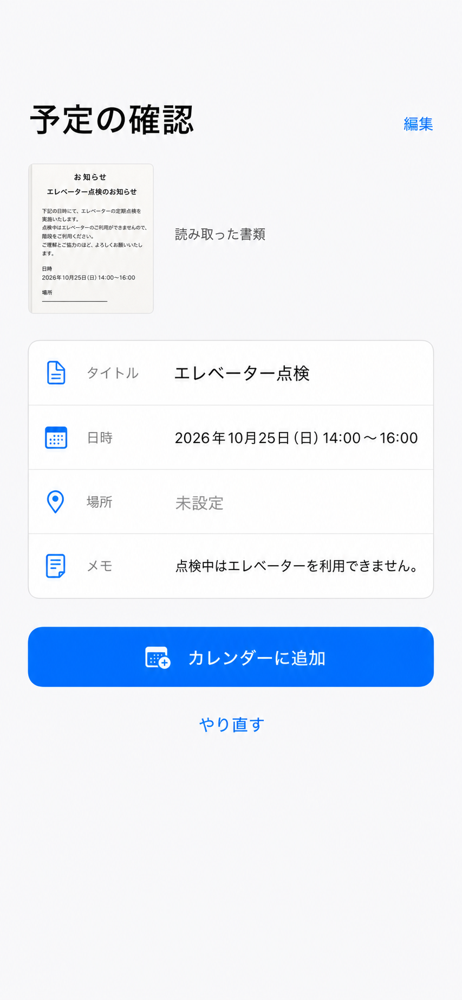

# LifeSnap Action Apple 原生风格 UI 改造设计

日期：2026-07-29
状态：待用户确认
选定方向：方案 2「书类优先、浅色原生 iOS」



## 1. 真实目标

让用户在最少认知负担下完成“选择书类 → 明确同意上传 → 核对予定 → 加入系统日历”，并让界面看起来像一款克制、可信的原生 iOS 工具，而不是 AI 演示页面。

相关第一原则：

- 理解与可读性优先于装饰。
- 用户目标优先于技术能力展示。
- 隐私风险控制优先于视觉惊喜。
- 可验证的完整流程优先于单张漂亮截图。

## 2. 最小可验证交付

在不改变提取 API、路由规则、日历写入逻辑和隐私披露实质内容的前提下，统一改造现有 7 个 SwiftUI 页面：

1. 书类选择 `CaptureView`
2. 上传同意 `UploadConsentView`
3. 读取中与错误 `ProcessingView`
4. 予定确认 `ReviewView`
5. 需要人工确认 `NeedsReviewView`
6. 未发现予定 `NoActionView`
7. 添加成功 `SuccessView`

同时增加仅存在于内存的书类缩略图传递，使确认页能够遵循选定的“书类优先”视觉方向。

## 3. 范围边界

### 本次会修改

- `ios/LifeSnapAction/App/LifeSnapActionApp.swift`
- `ios/LifeSnapAction/ViewModels/AppFlowCoordinator.swift`
- `ios/LifeSnapAction/Views/CaptureView.swift`
- `ios/LifeSnapAction/Views/UploadConsentView.swift`
- `ios/LifeSnapAction/Views/ProcessingView.swift`
- `ios/LifeSnapAction/Views/ReviewView.swift`
- `ios/LifeSnapAction/Views/NeedsReviewView.swift`
- `ios/LifeSnapAction/Views/NoActionView.swift`
- `ios/LifeSnapAction/Views/SuccessView.swift`
- 新增共享视觉组件文件，例如 `ios/LifeSnapAction/Views/DesignSystem.swift`
- `ios/LifeSnapActionTests/AppFlowCoordinatorTests.swift`
- `ios/LifeSnapAction.xcodeproj/project.pbxproj`（仅在新增 Swift 文件需要时）

### 明确不在范围内

- Cloud Run、Gemini 调用、提取模型与后端返回结构
- 日历权限策略和 `CalendarService`
- App 图标、启动图、品牌命名
- 隐私政策的实质承诺与 App Store 隐私答案
- 新功能、新页面、账号系统、图片持久化
- 发布、上传 TestFlight、部署或推送远端

## 4. 视觉系统

### 色彩

- 页面背景：`Color(uiColor: .systemGroupedBackground)` 或 `.systemBackground`
- 内容分组：`Color(uiColor: .secondarySystemGroupedBackground)`
- 主文字：`.primary`
- 辅助文字：`.secondary`
- 唯一品牌/操作强调色：系统蓝 `.blue`
- 状态色：系统 `.green`、`.orange`、`.red`
- 分隔线：系统 separator 色

禁止使用紫色/青色渐变、霓虹发光、装饰性玻璃、低透明度深色卡片和自制“AI 光效”。

### 字体与图标

- 只使用系统字体与 Dynamic Type 语义字号。
- 标题层级以 `.largeTitle`、`.title2`、`.headline`、`.body`、`.footnote` 为主。
- 避免页面内全部加粗；重点只给页面标题、字段值和主操作。
- 图标只使用 SF Symbols，不使用 emoji 作为功能图标。

### 形状与布局

- 使用原生分组列表/表单的空间逻辑，不堆叠等权重卡片。
- 主要圆角保持 12–14 pt，按钮最小高度 50 pt，所有可点击区域至少 44×44 pt。
- 每个页面只有一个视觉主操作；次操作使用文本按钮或低强调样式。
- 长页面的主操作使用 `safeAreaInset(edge: .bottom)` 固定在首屏可达位置。

### 深色模式

方案 2 以浅色为视觉基准，但所有颜色必须使用语义色，使深色模式自动适配。不得写死黑色文字或白色背景，尤其是 `DatePicker`、`TextField` 和 `TextEditor`。

## 5. 信息架构与逐页设计

### 5.1 书类选择

- 页面标题使用“书類から予定を追加”。
- 副文案说明“撮影または写真を選び、内容を確認してからカレンダーに追加します”。
- 主操作“カメラで撮影”使用系统蓝实心按钮。
- 次操作“写真から選ぶ”使用系统灰分组背景。
- 保留“每次上传前都会显示送信确认”的隐私提示和隐私政策链接。
- 去掉大号渐变图标、英文产品名主视觉和暗色舞台感。

### 5.2 上传同意

- 标题从“AI解析の前に確認してください”改为“画像の送信を確認”。
- 顶部展示清晰的书类预览。
- 首屏先显示目的、送信先、可能包含的信息、是否保存四项摘要。
- 完整披露内容放入可展开的“データの取り扱い詳細”，但不得删减实质信息；隐私政策链接继续独立可达。
- 主操作：
  - 首次上传：“同意して続ける”
  - 重试：“同意してもう一度試す”
- 次操作：“キャンセル”。
- 主操作固定在底部，避免因披露文字过长而掉到首屏外。

### 5.3 读取中与错误

- 标题使用“予定を読み取っています”。
- 副文案使用“日付・時間・場所を確認しています”。
- 使用原生 `ProgressView`，不显示“AI 正在解析”、循环扫描光圈或脉冲动画。
- 错误标题使用“読み取りできませんでした”，保留重新同意和取消路径。
- 开启 Reduce Motion 时不执行非必要过渡动画。

### 5.4 予定确认

- 视觉顺序严格遵循选定方案：
  1. 大标题“予定の確認”
  2. 右上文字按钮“編集”/“完了”
  3. “読み取った書類”缩略图
  4. 标题、日時、場所、メモ的分组摘要
  5. 固定底部主操作“カレンダーに追加”
  6. 次操作“やり直す”
- 默认不展示模型信赖度百分比。用户真正需要处理的异常只在对应字段旁显示“要確認”。
- 编辑模式使用原生 `TextField`、`DatePicker`、`Toggle`、`TextEditor`，所有控件在浅色和深色模式都必须清晰可读、无裁切。
- 保留日期已过期提醒、金额和发行方信息，但采用低干扰的系统分组行。
- 保留系统确认对话框和日历权限流程。

### 5.5 需要人工确认

- 标题使用“確認が必要です”，说明具体需要确认的字段。
- 风险标记转换为字段级提示，不再形成一组红色技术标签。
- 表单结构与普通确认页一致，避免用户进入完全不同的界面。
- 日时未确认前，底部按钮保持禁用并给出明确原因。

### 5.6 未发现予定

- 标题使用“予定は見つかりませんでした”。
- 说明“この書類には、カレンダーに追加できる日時情報が見つかりませんでした”。
- 唯一主操作为“別の書類を選ぶ”。
- 使用简洁 SF Symbol 和系统背景，不使用舞台式入场动画。

### 5.7 添加成功

- 标题使用“カレンダーに追加しました”。
- 显示事件标题、日期时间和地点的紧凑摘要。
- 主操作“カレンダーで確認”，次操作“別の書類を追加”。
- 使用单层系统绿色成功标识，去掉多层光圈与弹跳展示。

## 6. 文案原则

功能主流程不强调“AI”“Gemini”“信赖度”“抽出结果”等技术词：

- `抽出結果` → `予定の確認`
- `書類を解析中...` → `予定を読み取っています`
- `AIが予定情報を抽出しています` → `日付・時間・場所を確認しています`
- `同意してAI解析を開始` → `同意して続ける`
- `同意して再解析` → `同意してもう一度試す`

“Google Gemini”“Google Cloud Run”“AI 服务”只保留在用户必须知情的上传同意和隐私披露中，不能为了“去 AI 味”而隐藏实际数据处理方。

## 7. 书类缩略图与隐私

选定方案要求确认页能回看原始书类，但现有流程会在提取成功后立即清除 `captureVM.selectedImage`。实现方案如下：

- 在 `AppFlowCoordinator` 增加瞬时 `reviewImage: UIImage?`。
- 提取成功并进入 `.review` 或 `.needsReview` 时，只把现有 `UIImage` 引用转交给 `reviewImage`，随后仍清空 `captureVM.selectedImage`。
- `.noAction` 不保留缩略图。
- 取消、重新开始、添加成功或离开确认流程时立即清空 `reviewImage`。
- 不写入文件、数据库、缓存、相册、日志或网络之外的任何持久存储。
- 单元测试必须验证取消、无予定、成功和重置路径都会清除相关图片状态。

这保持“服务器不持久化、App 不持久化”的现有隐私边界，同时实现确认阶段的短暂回看。

## 8. 无障碍与适配

- 支持 Dynamic Type；文字放大后允许页面滚动，不截断标题、备忘和按钮文案。
- 交互区域最小 44×44 pt。
- VoiceOver 标签描述操作和书类预览，不朗读装饰性图标。
- 不禁用系统缩放。
- 浅色、深色、高对比度下保持语义色可读。
- 390×844 基准尺寸无水平溢出；同时检查较小 iPhone 尺寸。
- Reduce Motion 下关闭非必要缩放、旋转和弹跳动画。

## 9. 风险与护栏

| 风险 | 护栏 |
| --- | --- |
| 为显示缩略图意外延长图片生命周期 | 只增加内存引用；所有离开确认路径显式清空；测试覆盖 |
| 简化上传页面导致披露不足 | 摘要与完整披露同时保留；发送目的、接收方、个人信息、保留策略和取消结果必须可读 |
| 原生控件在深色模式中不可读 | 只使用语义色；实机/模拟器检查编辑态 |
| Dynamic Type 造成字段或按钮裁切 | 使用滚动容器、垂直扩展和底部安全区；以辅助功能字号截图验证 |
| 改造误触后端或日历逻辑 | 限定在视图、瞬时导航状态和相应测试，不修改 API/Service |
| 单页美观但流程断裂 | 从选择书类到成功页逐页走通并保留系统权限/确认对话框 |

## 10. 验收标准

1. 7 个页面统一为原生 iOS 视觉，没有紫青渐变、霓虹、玻璃或功能性 AI 展示文案。
2. 上传同意主按钮在 390×844 首屏可达，完整披露和隐私政策仍可访问。
3. 确认页包含瞬时书类缩略图，且图片不会持久化；离开流程后内存状态被清除。
4. 普通确认与人工确认的编辑控件在浅色/深色模式均清晰、无黑字黑底、占位符丢失或备忘裁切。
5. 每页只有一个主操作，所有控件至少 44 pt。
6. 390×844 和较小 iPhone 尺寸无水平滚动或内容溢出。
7. Dynamic Type 和 Reduce Motion 基本行为正常。
8. 现有同意门、重试门、提取路由、日历权限和添加确认行为不回归。
9. 单元测试与 iOS 构建通过；逐页模拟器截图完成视觉核对。

## 11. 验证命令与证据

使用当前可用模拟器 UUID；若 UUID 变化，先通过 `xcrun simctl list devices available` 解析，不硬编码不可用设备。

```bash
xcodebuild \
  -project ios/LifeSnapAction.xcodeproj \
  -scheme LifeSnapAction \
  -destination 'platform=iOS Simulator,id=56C4DC85-0732-49CF-8389-10D16B2BBDC3' \
  -derivedDataPath /tmp/lifesnap-ui-redesign-derived \
  CODE_SIGNING_ALLOWED=NO \
  build
```

```bash
xcodebuild \
  -project ios/LifeSnapAction.xcodeproj \
  -scheme LifeSnapAction \
  -destination 'platform=iOS Simulator,id=56C4DC85-0732-49CF-8389-10D16B2BBDC3' \
  -derivedDataPath /tmp/lifesnap-ui-redesign-derived \
  CODE_SIGNING_ALLOWED=NO \
  test
```

视觉证据：

- 390×844：选择、同意、读取中、确认、编辑、人工确认、未发现、成功。
- 浅色和深色：至少确认页与编辑页。
- 辅助功能字号：同意页与编辑页。
- 检查控制台错误、主按钮可达、水平溢出和日期控件文字对比度。

最终仓库检查：

```bash
git diff --check
git diff --stat
git status --short --branch
```

## 12. 完成定义

只有在构建与测试通过、逐页视觉证据完成、Git diff 已复核、状态已报告，并明确列出未验证的真机/生产边界后，才可称本次 UI 改造完成。
